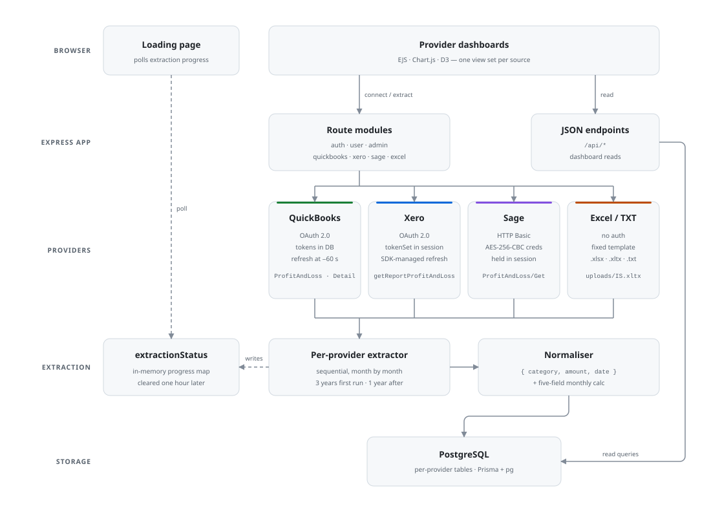
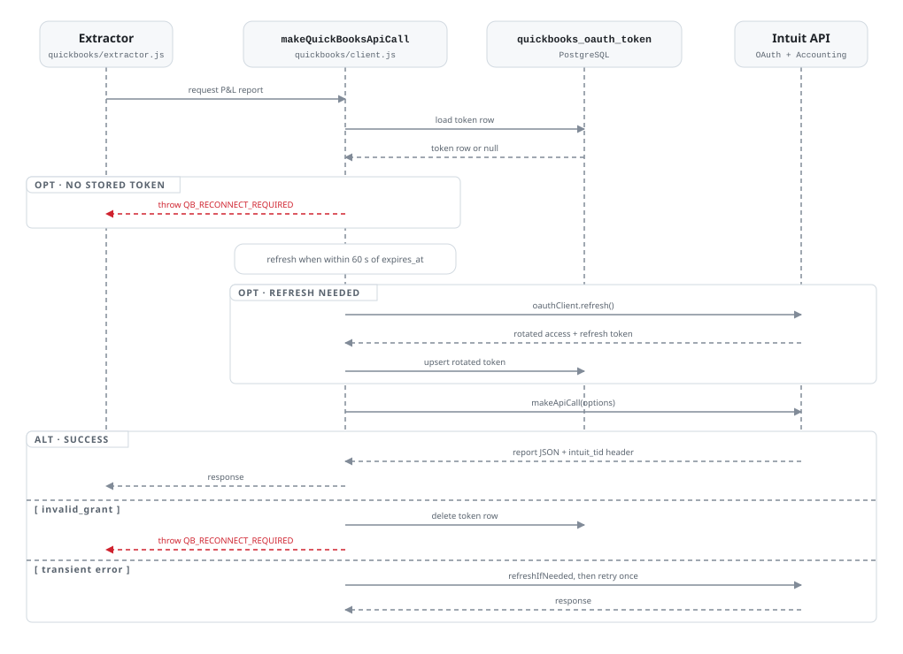

# BizExecData


A server-rendered Node/Express application that lets a business connect one accounting data source — QuickBooks Online, Xero, Sage Business Cloud, or a manual Excel/TXT upload — and turns its monthly profit-and-loss reports into a comparable time series in PostgreSQL.

Each source has a different authentication model and a structurally different report API. The core of the system is therefore an extraction layer that normalises four dissimilar shapes into a common `{category, amount, date}` row plus a monthly `{grossprofit, opexpenses, netprofit, sumofsales, sumofcost}` calc, then renders per-provider dashboards from those rows.

**Contents** — [Architecture](#architecture) · [End-to-end flow](#end-to-end-flow) · [Tech stack](#tech-stack) · [Technical decisions](#technical-decisions) · [Running locally](#running-locally) · [Project structure](#project-structure) · [Issues found and fixed](#issues-found-and-fixed) · [Limitations](#limitations-and-things-id-change)

## Architecture

<picture>
  <source media="(prefers-color-scheme: dark)" srcset="docs/architecture-dark.svg">
  
</picture>

The four provider lanes are deliberately parallel rather than unified: each keeps its own auth model and its own tables, and they only converge once the data has been reduced to a common shape.

> Diagrams are generated by [`docs/generate-diagrams.mjs`](docs/generate-diagrams.mjs) — one layout definition emits both the light and dark SVG, so the pair cannot drift. Re-run `node docs/generate-diagrams.mjs` after editing it.

## End-to-end flow

What actually happens from a cold start, including the parts that will block you on a fresh install:

1. **Register** (`POST /register`) — creates a `user_table` row with `roleid = 4` and `status = "pending"`, plus a `license_management` row with `status = "Pending"`.
2. **Admin approval** — login is refused until *both* `user_table.status = "approved"` **and** the user's license `status = "Paid"` ([auth/controller.js](src/modules/auth/controller.js)). An admin is any user with `roleid = 10` ([middleware/admin.js](src/middleware/admin.js)); they approve from `/companyregapplications` and mark licenses paid from `/licensemgt`.
3. **Connect a source** — the user is sent through the auth flow for their chosen provider, or straight to the upload page for Excel.
4. **Extract** — `POST /start-*-extraction` kicks off processing without blocking the response. The browser is parked on a loading page that polls `check-*-extraction` for `{progress, complete, total}`.
5. **Dashboards** — per-provider EJS views read the normalised rows back through `api/*`.

> **Local dev shortcut:** there is no seeded admin and no self-approval path, so the first account cannot log in. Set `status = 'approved'` on the `user_table` row and `status = 'Paid'` on its `license_management` row directly in the database.

## Tech stack

| Technology | Why it's here |
|---|---|
| Node.js (ES modules) + Express 4 | HTTP server and routing; modules are split by feature under `src/modules/*`. |
| PostgreSQL | Relational store; financial data is naturally tabular and time-indexed. |
| Prisma 7 + `@prisma/adapter-pg` | Typed DB access over an explicit `pg` connection pool, so SSL and pooling are controlled directly. |
| Passport (local strategy) + bcrypt | Email/password auth; bcrypt for password hashing. |
| `intuit-oauth` | QuickBooks OAuth2 client — handles the authorize/token/refresh exchange. |
| `xero-node` | Xero OAuth2 + Accounting API SDK, including consent URL and report calls. |
| `node-fetch` | Plain HTTP for the Sage REST API (Basic auth), which has no first-party SDK here. |
| `jsonpath` | Extracts values from the deeply nested, differently-shaped P&L JSON of each provider. |
| `xlsx` (SheetJS) | Parses uploaded income-statement workbooks by cell position. |
| `express-session` | Server-side sessions; also the store for Xero tokens and encrypted Sage credentials. |
| `express-rate-limit` | Limits login attempts (5 per 15 min) on `POST /login`. |
| `helmet` | Security headers and a Content-Security-Policy. |
| Node `crypto` (AES-256-CBC) | Encrypts the Sage password before it is held in the session. |
| Chart.js + D3 | Client-side charts on the dashboards. |
| EJS | Server-rendered views and partials per provider. |
| Pino | Structured, per-module logging. |
| Jest + Supertest | Tests for the app boot path, auth middleware, and the four P&L normalisers against recorded fixtures. |

Intuit's App Store security requirements and how they are met are documented separately in [SECURITY_COMPLIANCE.md](SECURITY_COMPLIANCE.md).

## Technical decisions

### 1. Three authentication models, not one abstraction

The brief expected "OAuth across three providers," but the code reflects what each provider actually offers:

- **QuickBooks — OAuth2 with DB-persisted tokens and explicit refresh.** Tokens live per user in `quickbooks_oauth_token` with an `expires_at`. Every call goes through `makeQuickBooksApiCall` ([client.js](src/modules/quickbooks/client.js)), which refreshes within 60 seconds of expiry, writes the rotated token back, and retries once on failure.
- **Xero — OAuth2 with session-held tokens.** `xero-node` requests `offline_access` and the token set is stored on `req.session.tokenSet`; refresh is delegated to the SDK rather than tracked against an `expires_at` of our own.
- **Sage — HTTP Basic, not OAuth.** Sage's reseller API authenticates with the user's username/password on every request. The password is encrypted with AES-256-CBC and stored on the session ([sage/routes.js](src/modules/sage/routes.js)), then decrypted at extraction time ([sage/controller.js](src/modules/sage/controller.js)) to build the `Authorization` header.

Keeping these separate is what lets each provider use its native auth without pretending Sage is something it isn't.

**QuickBooks is the involved one.** It is the only path that persists tokens itself, so it is also the only one that has to distinguish a dead grant from a transient failure:

<picture>
  <source media="(prefers-color-scheme: dark)" srcset="docs/quickbooks-token-dark.svg">
  
</picture>

Two details worth calling out:

- **Forced reconnect on a dead refresh token.** `invalid_grant` — whether it surfaces during refresh or during the call itself — clears the stored token and raises `QB_RECONNECT_REQUIRED`, which routes turn into a redirect to `/quickbooks/auth?error=reconnect_required` rather than a 500.
- **`intuit_tid` capture.** Every call logs Intuit's transaction ID from the response headers, on both the success and error paths and across three possible header locations. It is the first thing Intuit asks for when raising a support case.

Both OAuth providers generate `crypto.randomBytes(24)` as a `state` at the authorize step, persist it on the session before redirecting, and reject a mismatched callback with a 403 before exchanging the code. The Xero side is worth a note: `xero-node` *looks* like it validates state for you — `apiCallback` passes `{ state: this.config.state }` to `openid-client` as a check — but when `config.state` is unset, no state is sent on the consent URL, none comes back, and the check passes vacuously. Setting it per request is what makes that check real.

### 2. Normalising three structurally different report APIs

There is no single source-agnostic table. Each provider writes to its own tables (`company_calcs`/`revenue`/`expenses`/`costofsales`, `xero_*`, `sage_*`, `excel_companydata`) that share an identical **column shape**. The interesting work is in the extractors that converge on that shape from very different inputs:

- **QuickBooks** returns an arbitrarily nested `Rows.Row` tree. A single recursive walker (`findFinancialData`) descends `ColData`/`Rows`/`Header` and applies whichever upsert it is handed, so the same routine serves the income, cost, expense and other-income passes. `jsonpath` filters select line items by `group` (`Income`, `COGS`, `Expenses`, `OtherIncome`); monthly totals come from `Summary.ColData[6]` of the `ProfitAndLossDetail` report.
- **Xero** returns report rows tagged by `rowType`; `jsonpath` selects `SummaryRow` cells by label (`Total Income`, `Total Operating Expenses`, `Gross Profit`) and line rows under titled sections.
- **Sage** returns a tree keyed by `Description`; `jsonpath` selects `Sales`/`Expenses`/`Cost of Sales` children and reads totals from rows where `ReportingLevelType == 10`.

All three funnel into the same `{userid, category, amount, date}` line rows and the same five-field monthly calc, so a dashboard query is identical regardless of source. The tradeoff — parallel per-provider tables instead of one table with a `source` column — keeps each provider's quirks isolated at the cost of duplicated table definitions.

### 3. Excel/TXT upload as a first-class fallback

For businesses not on a supported cloud platform, an income-statement workbook can be uploaded directly. Accepted extensions are `.xlsx`, `.xls`, `.xltx` and `.txt` ([excel/routes.js](src/modules/excel/routes.js)). The parser ([excel/controller.js](src/modules/excel/controller.js)) is built around the template's conventions rather than a fixed row list:

- The report date is read from cell **F3**, handling both native dates and Excel serial numbers.
- Category is inferred **dynamically**: the parser walks rows top-to-bottom tracking the most recently seen header (`REVENUE`, `COST OF GOODS SOLD`, `OTHER INCOME`, `EXPENSES`, `TOTAL`) and assigns following line items to it. Inferring from the last-seen header rather than a static map means the parser tolerates layout changes within the template without code edits.
- Column **F (formula-computed) is preferred over column E (manual entry)**, so cached totals are captured correctly.
- Label variants are normalised (`COGS` → `Cost of goods sold`), and recognised summary rows are reassigned to a `TOTAL` category so dashboard queries stay consistent.
- Uploads are guarded against **future dates** and **duplicate months**; a separate amend flow upserts the current month and deletes subcategories that disappeared from the re-uploaded file.

The `.txt` path defaults all entries to `EXPENSES` — usable, but the least structured of the inputs.

### 4. Incremental, diff-based extraction instead of caching

There is no caching layer and no general rate limiter on the provider calls. The efficiency decisions are in the extraction loop itself:

- A `first_time_insertion` flag drives the range: **3 years back on first connect, 1 year on refresh**.
- Writes are **diff-based** — a row is only updated when the incoming amount differs from what is stored, and only inserted when absent. Re-running extraction is close to a no-op when nothing changed.
- Calls are issued **sequentially, month by month** (`await` in series), which naturally throttles request volume. Sage additionally sleeps 1 s between months to stay friendly to its API.
- Progress lives in an **in-memory map** (`extractionStatus`) rather than the DB, exposed via `check-*-extraction` for the loading page to poll, and cleared an hour after completion.

## Running locally

### Prerequisites

- Node.js 20+
- PostgreSQL 14+
- Developer/sandbox app credentials for QuickBooks and Xero, and a Sage reseller API key, if you want to exercise those flows. **The Excel upload path works without any provider credentials.**

### Steps

```bash
git clone https://github.com/Kiveshan/BizExecData.git
cd BizExecData
npm install

cp .env.example .env      # then fill in your own values

npx prisma generate       # generate the client
npx prisma migrate dev    # apply migrations to an existing, empty database

npm run dev               # nodemon on PORT (default 3000)
```

Open `http://localhost:3000`, then see the [local dev shortcut](#end-to-end-flow) above for getting past the approval gate.

### Environment

All variables are listed with placeholder values in [.env.example](.env.example). Copy it and substitute your own — the four that trip people up:

| Variable | Note |
|---|---|
| `ENCRYPTION_KEY` | Must be **exactly 32 bytes** (AES-256) and has **no fallback** — encryption and decryption throw without it. |
| `DATABASE_URL` | The only connection string the live data path uses, via `src/config/prismaClient.js`. |
| `QB_ENVIRONMENT` | `sandbox` (default) or `production`; selects the Intuit API base URL. |
| `SAGE_API_KEY` | Required for the Sage flows. `SAGE_BASE_API_URL` is optional and defaults to the SA reseller endpoint in code. |

`IV_LENGTH` is fixed at 16 in code and is not an environment variable.

### Tests, linting and deployment

```bash
npm test          # Jest (run via experimental VM modules)
npm run test:watch
npm run lint
npm run lint:fix
```

55 tests across 6 suites. Beyond the app boot path and auth middleware, the bulk of it covers the four P&L normalisers against **recorded fixtures** — one captured response shape per provider ([src/\_\_tests\_\_/fixtures/](src/__tests__/fixtures/)), plus the committed `uploads/IS1.xlsx` template standing in as its own fixture for the Excel path.

The normaliser tests are the ones that earn their keep: each provider returns a structurally different report, and these pin down exactly which rows are picked up, which are deliberately skipped, and what happens when a section or total is missing. Where a report carries both line items and its own totals, the tests assert the line items **reconcile** against the total rather than just matching a hardcoded number — which is what caught the Excel cost-of-goods bug described under [Issues found and fixed](#issues-found-and-fixed).

[`.github/workflows/deploy-prod.yaml`](.github/workflows/deploy-prod.yaml) runs migrations, ESLint and the test suite on every push to `main`, then packages the app and deploys it to AWS Elastic Beanstalk (`af-south-1`). There is no staging workflow.

## Project structure

```
BizExecData/
├── server.js                  # Entry point: mounts route modules, static assets, error handlers, listen()
├── prisma.config.ts           # Prisma config
├── SECURITY_COMPLIANCE.md     # How the app meets Intuit's App Store security requirements
├── prisma/
│   ├── schema.prisma          # 17 models: user_table, roles, per-provider calc/line tables, oauth token
│   └── migrations/            # SQL migration history
├── docs/
│   ├── generate-diagrams.mjs  # Emits the README diagrams as light/dark SVG pairs
│   └── *.svg                  # Generated — edit the script, not these
├── src/
│   ├── app.js                 # Express app: helmet, CORS, sessions, passport, rate limiter, file upload
│   ├── config/                # env, prismaClient (pg pool + adapter), passport, security
│   ├── middleware/            # auth guards, admin guard, session factory, error handler
│   ├── modules/               # Feature modules, each with routes + controller/extractor/client
│   │   ├── auth/              #   local login/register
│   │   ├── user/              #   user-facing pages/data
│   │   ├── admin/             #   approval + license management
│   │   ├── quickbooks/        #   OAuth client, token refresh, recursive P&L extractor
│   │   ├── xero/              #   OAuth via xero-node, summary/line extractors
│   │   ├── sage/              #   Basic-auth client, encrypted-credential extraction
│   │   └── excel/             #   workbook/txt parsing, upload + amend flows
│   ├── utils/                 # crypto (AES), file/date helpers, logger, validation
│   ├── generated/prisma/      # Generated Prisma client — gitignored
│   └── __tests__/             # Jest: boot path, auth middleware, P&L normalisers
│       ├── fixtures/          #   recorded provider report shapes
│       └── modules/           #   xero/quickbooks/sage/excel normaliser tests
├── views/                     # EJS templates
│   ├── layouts/               #   page layout
│   ├── pages/                 #   per-provider head/body fragments
│   └── partials/              #   navbars, sidebars, footer (per provider)
├── public/                    # Static assets, styles, and _legacy_html/ (pre-EJS pages, unused)
├── uploads/                   # Excel income-statement templates (IS1.xlsx doubles as a test fixture)
└── .github/workflows/         # Elastic Beanstalk deploy (prod, on push to main)
```

## Issues found and fixed

A self-review of this codebase turned up four defects worth writing up, three of them security or correctness bugs that were live in the deployed app.

- **Xero's OAuth callback accepted any `state` (CSRF).** QuickBooks generated and verified a `state`; Xero did neither, so its callback would exchange an attacker-supplied authorization code and bind the victim's session to the attacker's Xero org. The subtlety is that `xero-node` appears to cover this — `apiCallback` hands `{ state: this.config.state }` to `openid-client` — but with `config.state` undefined, no state is ever sent, nothing comes back, and the check silently passes. **Fixed** in [xero/routes.js](src/modules/xero/routes.js): a `crypto.randomBytes(24)` state is stored on the session and saved before the redirect, compared on callback, and set on the client so the SDK's own check has something to verify.

- **Provider clients were module-level singletons (cross-tenant data leak).** `XeroClient` and `intuit-oauth`'s `OAuthClient` both hold the active token — and Xero also holds the resolved tenant list — as mutable state on the instance. With one shared instance, a second user connecting mid-extraction overwrote `xero.tenants`, and the still-running background job would read the *new* tenant's P&L and write it under the *first* user's `userid`. **Fixed** by making both clients per-request factories ([xero/client.js](src/modules/xero/client.js), [quickbooks/client.js](src/modules/quickbooks/client.js)); `processXeroData` now receives the token set and tenant id captured from the session that started it, rather than reading shared state.

- **The Excel COGS total never reached the database.** `parseIncomeStatementRows` treated any label matching a known section header as a header — but the cost-of-goods total row is labelled `Cost of goods sold`, which upper-cases to its own section header `COST OF GOODS SOLD`. The total was swallowed as a header and dropped, so `getExcelCompanyData` — which reads exactly that subcategory — reported cost of sales as `R0.00` for every uploaded workbook. **Fixed** in [excel/controller.js](src/modules/excel/controller.js) by applying the convention the parser already documented: a header is a known label *with no amount on the row*. Found by writing the fixture test below, not by reading the code.

- **Dead code carrying a hardcoded password.** `src/config/database.js` was unused but still shipped a `"123456"` fallback DB password behind `RDS_*` variables, and root `passport-config.js` — its only consumer — duplicated `src/config/passport.js`. **Both deleted.**

## Limitations and things I'd change

- **`uploads/` is gitignored but its templates are tracked.** `IS.xltx` and `IS1.xlsx` were committed before the ignore rule was added, so they survive by accident; a new template dropped in that folder would be silently untracked. Both are the stock OfficeReady income-statement template with placeholder figures — no client data — and `IS1.xlsx` now doubles as a test fixture, so they are worth keeping deliberately rather than by accident.
- **Several admin endpoints are disabled.** `getAdminDashboard`, `getApprovedUsers` and `previewUser` return `410 Gone` ("not available on this deployment"), so the admin surface is narrower than the routes suggest.
- **Test coverage stops at the normalisers.** The four P&L normalisers are covered against recorded fixtures (below), but the route handlers, token-refresh paths and Prisma upserts are not. Those need either a test database or a mocked Prisma client; the recursive `findFinancialData` walker is covered, its four `upsert*` callees are not.
- **Sage line items throw on a missing `Total`, cost-of-sales defaults to 0.** `extractSageRevenue`/`extractSageExpenses` read `item.Total[0]` directly while `extractSageCostOfSales` guards with `item.Total ? ... : 0`. A Sales group with no movement therefore aborts the whole month rather than recording zero. The asymmetry is pinned by tests; it predates this pass and is left as-is pending a decision on which behaviour is correct.
- **Provider data lives in parallel tables.** A single table with a `source` discriminator would remove the duplicated `xero_*`/`sage_*`/base schema and simplify cross-source comparison, at the cost of mixing provider quirks in one place.
- **Sage uses Basic auth with credentials in the session.** This is a constraint of the API surface used here; an OAuth-based Sage integration would avoid handling the user's password at all.

## License

[MIT](LICENSE).
